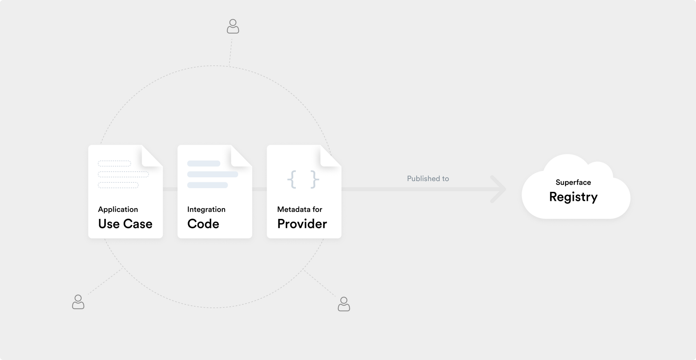
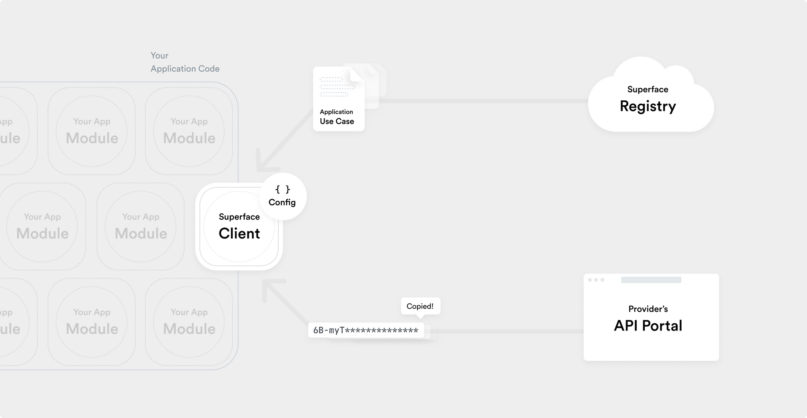
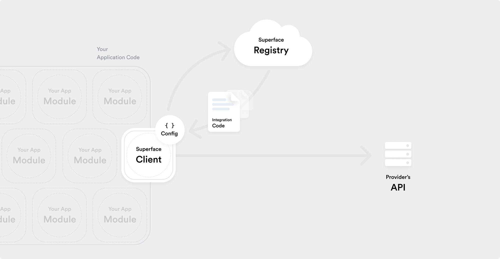

# How Superface works

Superface is a language and a protocol for abstracting integrations as application use-cases. It allows use-case discovery and distribution of integration code at runtime.

This approach gives you a framework to decouple the lifecycle of your application from the integrations it uses.

## Build and publish the integration

The registry is a service, that allows use-case discovery and distribution of integration code at runtime. It also allows the authors to test the integration code that’s specific to each provider completely decoupled from any application code.

1. Create use-case by defining application needs. It enables you to describe the business behaviour of an application without the need to go into detail of implementation.
2. Define provider’s available services and authentication mechanisms.
3. Write integration code to connect use-case to specific provider. It essentially maps the application (business) semantics into provider’s interface implementation.
4. Publish to registry.

_Application use-cases with specific integration code are published to the registry._

## Use the client in your code

The client enables you to write your code around the use-case interface without the knowledge of any implementation details yet.

1. Install a use-case from the registry.
2. Install Superface client and use it in your code.
3. Configure which provider APIs you trust and should be used in runtime.
4. Bring your own credentials for the provider APIs you decide to use. Client uses these credentials to interact with the provider directly.

_During app development use-case is installed to provide an interface to program around._

## Run your code

Run your code with the client installed. Let the client obtain the latest integration code from the registry and interact with the provider API.

_In runtime, the client obtains the latest version of integration code and interacts with the API._
