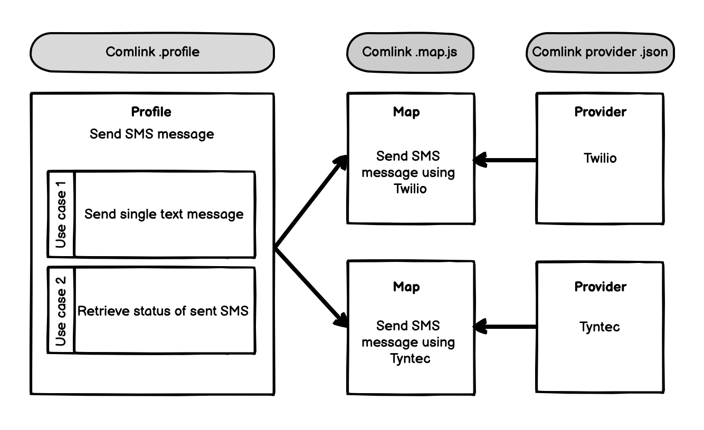

# How to integrate new API: Overview

This guide walks you through the process of creating a new API integration. You will learn how to setup the development environment, use the CLI to generate Comlinks for providers and use cases, integrate the API in your application, and run it in the production.

Superface created new domain-specific language called _Comlink_ for abstracting API integrations. Comlink language is designed to help developers create reusable, platform-agnostic API integrations.

Comlink language documents the integration for humans and describes the integration for machines to perform the API calls and understand API responses.

## Understanding the Superface terms

Comlink is probably new to you, so let's cover the terms you will deal with throughout this guide. The _Comlink_ language key concepts are _Profile_, _Use Case_, _Map_, and _Provider_. Let's break down what each of them means:

- [Profile](../reference/glossary.md#profile) is collection of _use cases_ that serves common cause. Profiles are files with `.profile` extension.
- [Use Case](../reference/glossary.md#use-case) represents a functionality that serves a business need.
- [Map](../reference/glossary.md#map) connects the _Use Case_ to a _Provider_. Maps are files with `.map.js` extension.
- [Provider](../reference/glossary.md#provider) is a JSON file describing a set of host URLs, security schemes and integration parameters that fulfill use cases.

