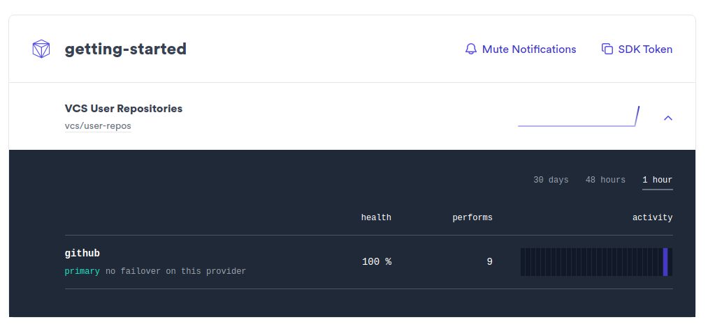
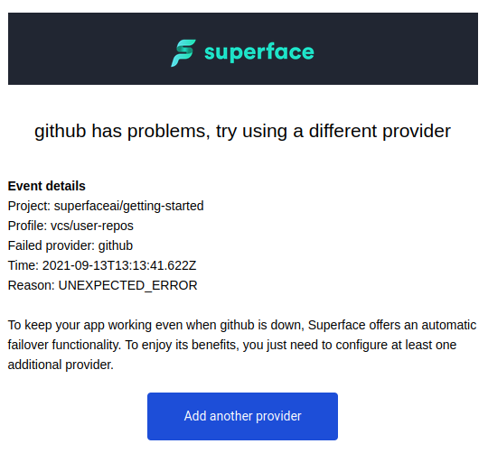

# Integrations monitoring

Superface comes with out-of-the-box monitoring of integrations used by your App. With Superface project you will get insights on your App's API dependencies and their health status. In case of use-case failure, you will also receive an email notification with details about the failing API calls.

## Set up integrations monitoring

### Prerequisites

- Node.js app with OneSDK and a capability set up; see [Getting&nbsp;started](../getting-started.mdx) to create one
- Registered account on [superface.ai](https://superface.ai/) to access insights

<div class="count-steps-h3">

### Create new project

Create a new project in [Superface](/insights).

<!-- TODO: screenshot -->

### Get your SDK token

Copy the project's SDK token.

### Use the SDK token with your Application

In command line, set the token as `SUPERFACE_SDK_TOKEN` environment variable:

```shell
export SUPERFACE_SDK_TOKEN="<your token>"
```

Run your application again:

```shell
node index.js
```

### Check Insights

Observe how are the use-cases used by your application.



### Monitor your API dependencies

In the case of API failure Superface will email you with the notification.



</div>

<!-- TODO: Publish other topics first

## Next steps

This covers basic usage of the Superface and OneSDK. Start using Superface capabilities with your existing apps or check out the following topics.

### Install other capabilities

Lorem ipsum.

### Configure additional providers

Lorem ipsum.

### Setup failover

Lorem ipsum.

### Add custom capabilities

If you need a capability which is not available in the catalog, see [How to create a capability](./how-to-create.md) guide to make a custom capability from scratch.

-->
