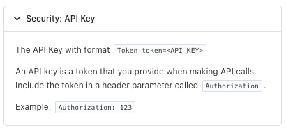

# Setting security schemes

The Comlink provider is the key to ensuring that Superface can create accurate, working profiles and maps for your intented use case.

In this guide we'll show you an example that will help you determine how to set up the security scheme for the API you want to use.

## What is the provider security scheme?

A Comlink provider contains valuable information, such as the base URL for the API you're connecting to, any additional parameters that are required to make API requests, and, importantly, how the API should be authenticated.

You can see each of the supported security schemes in the [Editing Comlink providers](./editing-provider-files#security-schemes) documentation.

## Example

Here's how to translate an APIs authentication requirement over to the security scheme in your `provider.json` file.

### PagerDuty

Reference documentation: [PagerDuty List Incidents](https://developer.pagerduty.com/api-reference/9d0b4b12e36f9-list-incidents)



Requirement: `Token token=<API_KEY>` passed in `Authorization` header of request.

This is quite a custom approach to API key header authentication from PagerDuty, so in order to make sure you format the token correctly it is best to set your environment variable as such: `PAGERDUTY_API_KEY="Token token=<API_KEY>"`.

The security scheme to reflect this would be:

```json title="pagerduty.provider.json"
"securitySchemes": [
    {
        "type": "apiKey",
        "in": "header",
        "name": "Authorization",
        "id": "pagerdutyToken"
    }
]
```

Then, when you run the `superface map` command to create code for use in your application, it would look like this:

```json title="incident-management.get-incidents.pagerduty.mjs"
security: {
    pagerdutyToken: {
        apikey: process.env.PAGERDUTY_API_KEY
    }
}
```

## Different Schemes

For more information on the different types of security schemes supported in Comlink and OneSDK, including query string, basic auth, and digest, check out the Secuity Schemes section of our [Editing Providers](./editing-provider-files#security-schemes) documentation.
